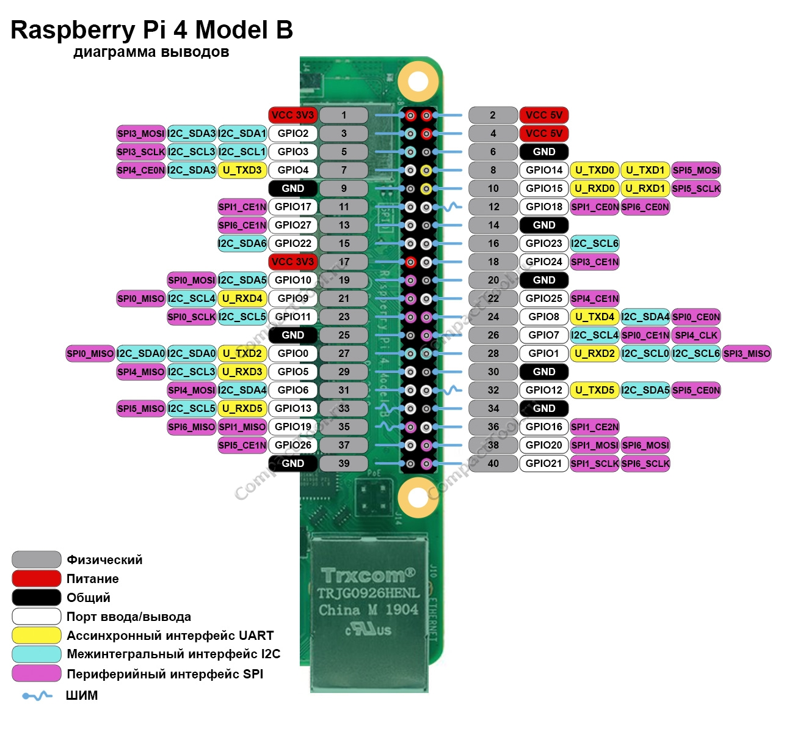

# c40

## Подготовка Raspberry Pi

1. Скачай и запиши образ Raspberry Pi OS.
2. Подключитесь к терминалу устройства любым удобным способом (по сети: ssh, xrdp или монитор, клавиатура и мышь).
3. Обеспечите доступ к интернету.

## Команда для авто установки:

```bash
curl -fsSL https://raw.githubusercontent.com/nodax-hub/c40/refs/heads/master/install.sh | sudo bash
```

# Схема подключения:


```
Raspberry Pi 4B
────────────────────────────────────────

 UART0:
  pin  8  → TXD (GPIO14)
  pin 10  → RXD (GPIO15)

 I2C (дальномер VL53L0X):
  pin  3  → SDA (GPIO2)
  pin  5  → SCL (GPIO3)
  pin  1  → 3.3V
  pin  6  → GND

 1-Wire (температура DS18B20):
  pin  7  → GPIO4 (DQ, через резистор 4.7k к 3.3V)
  pin  1  → 3.3V
  pin  6  → GND

 Концевики:

  pin  1 → 3.3V
  pin  6 → GND (общий)

  pin 15 → GPIO22
  pin 16 → GPIO23
  pin 18 → GPIO24
  pin 22 → GPIO25

  Каждый вход:
    3.3V ---[концевик]--- GPIO22/23/24/25
    pull-down включён программно
```


# Ручная настройка:

## 1. Включение интерфейсов (I²C и 1-Wire)

### 1.1 Включить интерфейсы через `raspi-config`

```bash
sudo raspi-config
```

В меню:

* **Interfacing Options → I2C → Yes**
* **Interfacing Options → 1-Wire → Yes**

Перезагрузить:

```bash
sudo reboot
```

---

## 2. Подключение датчиков и концевиков

Все подключения делай при **выключенном питании** Raspberry Pi.

---

### 1 I²C (дальномер VL53L0X)

| Raspberry Pi Pin | Назначение  |
| ---------------- | ----------- |
| Pin 1            | 3.3V        |
| Pin 3            | SDA (GPIO2) |
| Pin 5            | SCL (GPIO3) |
| Pin 6            | GND         |

Сигнальные линии SDA/SCL должны иметь **подтягивающие резисторы** (часто уже на плате датчика). ([GitHub][1])

---

### 2 1-Wire (температурный датчик DS18B20)

| Raspberry Pi Pin | Назначение |
| ---------------- | ---------- |
| Pin 1            | 3.3V       |
| Pin 7            | GPIO4 (DQ) |
| Pin 6            | GND        |

**Обязательный элемент:** резистор **4.7 кΩ** между GPIO4 и 3.3 V (pull-up). ([GitHub][1])

---

### 3 Концевые выключатели

Схема подключения:

| Raspberry Pi Pin | GPIO   |
| ---------------- | ------ |
| Pin 15           | GPIO22 |
| Pin 16           | GPIO23 |
| Pin 18           | GPIO24 |
| Pin 22           | GPIO25 |

Питание и земля:

| Raspberry Pi Pin | Назначение |
| ---------------- | ---------- |
| Pin 1            | 3.3V       |
| Pin 6            | GND        |

**Схема для каждого входа:**

```
3.3V ---[концевик]--- GPIOxx
```

При этом **pull-down включён программно** (в коде).

---


## 2. Проверка интерфейсов

На этом этапе оборудование уже должно быть подключено согласно схеме.

### 1 Проверка I²C

Установить утилиты:

```bash
sudo apt update
sudo apt install i2c-tools -y
```

Запустить скан:

```bash
sudo i2cdetect -y 1
```

Должен увидеть адрес VL53L0X (`0x29`)

---

### 2 Проверка 1-Wire

```bash
ls /sys/bus/w1/devices/
```

Должны появиться каталоги устройств вроде `28-...` (DS18B20).

---


## 3. Установка и запуск проекта

### 1 Получить исходный код проекта

```bash
git clone https://github.com/nodax-hub/c40.git
cd c40
```

---

### 2 Выполнить обычную установку вручную

Все необходимые шаги установки находятся в скрипте [install.sh](install.sh)


---

## 4. Проверка работы сервиса

### 1 Статус сервиса

```bash
sudo systemctl status c40.service
```

---

### 2 Логи в реальном времени

```bash
journalctl -u c40.service -f
```

---

## 5. Программная проверка интерфейсов

### 1 Проверка I²C в Python

```python
from smbus2 import SMBus

with SMBus(1) as bus:
    addr = 0x29  # адрес VL53L0X
    data = bus.read_i2c_block_data(addr, 0, 1)
    print(data)
```

---

### 2 Проверка 1-Wire в терминале

```bash
cat /sys/bus/w1/devices/28-*/w1_slave
```

Вернёт температуру. ([GitHub][1])

---

### 3 Проверка концевиков в Python

```python
import RPi.GPIO as GPIO

pins = [22, 23, 24, 25]
GPIO.setmode(GPIO.BCM)
for p in pins:
    GPIO.setup(p, GPIO.IN, pull_up_down=GPIO.PUD_DOWN)
    print(p, GPIO.input(p))
```

---

## FAQ

* **I²C-устройство не видно в i2cdetect** — проверь SDA/SCL и подтяжку.
* **1-Wire датчик не появляется** — проверь резистор и питание.
* **Концевики читают неверно** — проверь режим pull-down в коде.

---
